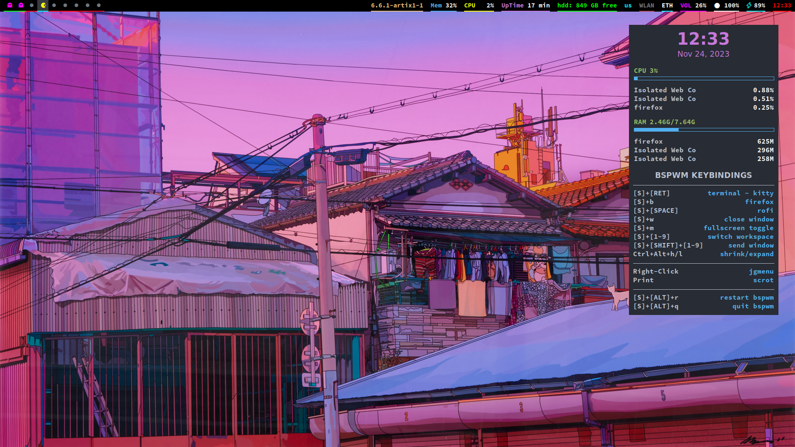

# dotfiles
Customization Files for Linux or Other Unix-Based System. This Repository Contains My Personal Dotfiles.


⚠️ **NOTE!!!!!** This configuration was made for my Laptop, so some things might not work on your PC or Laptop as this was never intended to be a usable full fledged system, in that case, please try if you can fix that up as much as possible, or you can open an issue for help :) - This was made for a **1920x1080** screen and on a **Laptop** with **96** dpi.

## Info


* **Distro** - **[Artix Linux](https://artixlinux.org/)**.
* **System Init** - [runit](http://smarden.org/runit/).
* **WM** - [BSPWM](https://github.com/baskerville/bspwm).
* **Bar** - [Polybar](https://github.com/polybar/polybar).
* **Menu** - [Rofi](https://github.com/davatorium/rofi).
* **Compositor** - [Picom](https://github.com/yshui/picom).
* **Shell** - [Bash](https://www.gnu.org/software/bash/).
* **Terminal** - [Kitty](https://sw.kovidgoyal.net/kitty/).
* **Editor** - [Vim](https://www.vim.org/) and [NeoVim](https://neovim.io/).
* **Multiplexer** - [TMUX](https://github.com/tmux/tmux).
* **System Monitor** - [Conky](https://github.com/brndnmtthws/conky).
* **AUR Helper** - [Yay](https://github.com/Jguer/yay).

## Requirements
```sh
git clone https://github.com/soelz4/dotfiles.git
```
```sh
cd dotfiles
```
```sh
chmod +x pkgs.sh
```
```sh
./pkgs.sh
```

<br></br>
