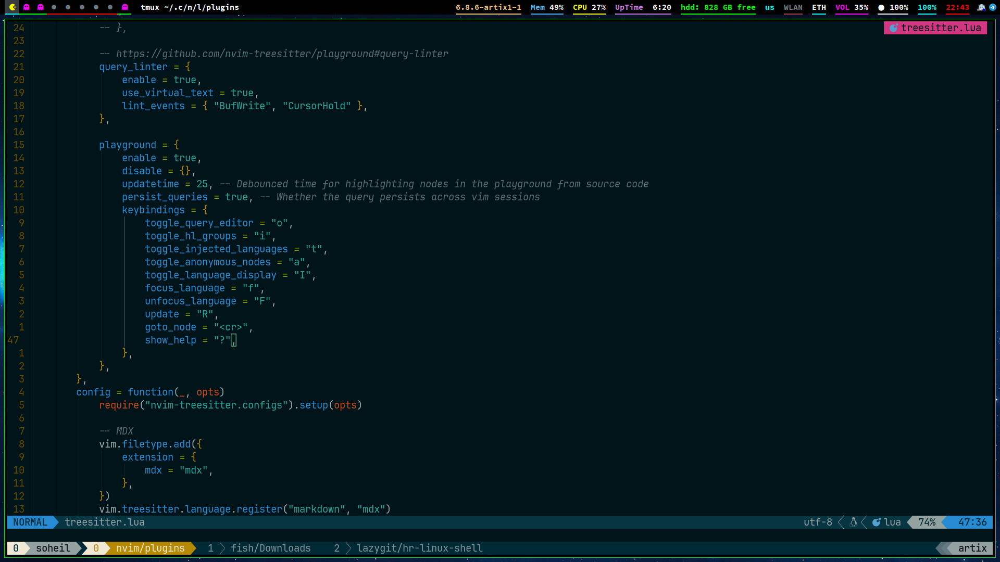

# dotfiles



Customization Files for Linux or Other Unix-Based System. This Repository Contains My Personal Dotfiles.


<br>

> ⚠️ **NOTE!!!!!** This configuration was made for my Laptop, so some things might not work on your PC or Laptop as this was never intended to be a usable full fledged system, in that case, please try if you can fix that up as much as possible, or you can open an issue for help :) - This was made for a **1920x1080** screen and on a **Laptop** with **96** dpi.

<br>

## Info


- **Distro** - **[Artix Linux](https://artixlinux.org/)**.
- **System Init** - [runit](http://smarden.org/runit/).
- **WM** - [BSPWM](https://github.com/baskerville/bspwm).
- **Bar** - [Polybar](https://github.com/polybar/polybar).
- **Menu** - [Rofi](https://github.com/davatorium/rofi).
- **Compositor** - [Picom](https://github.com/yshui/picom).
- **Shell** - [Fish](https://fishshell.com/).
- **Terminal** - [WezTerm](https://wezfurlong.org/wezterm/).
- **Editor** - [Vim](https://www.vim.org/) and [NeoVim](https://neovim.io/).
- **Multiplexer** - [TMUX](https://github.com/tmux/tmux).
- **System Monitor** - [Conky](https://github.com/brndnmtthws/conky).
- **Notification** - [Dunst](https://github.com/dunst-project/dunst).
- **AUR Helper** - [Yay](https://github.com/Jguer/yay).

## Requirements

1 - First of All if You are Using Artix Linux you Must add Arch Linux Extre Repository to your System
for this Please Check [Artix Linux Wiki](https://wiki.artixlinux.org/Main/Repositories).

2 - [NerdFonts](https://github.com/ryanoasis/nerd-fonts).

## Script

⚠️ **NOTE!!!!!** Important Points About Packages List and System Init. Since I am Using an Artix Linux with Runit System Init, You may not Need to do Some Steps.
If you are Using a non-Systemd Init System, You Must do Somethings in Your Own Way.
if You are Using Systemd Init System, You Must Check the [Packages List](https://github.com/soelz4/dotfiles/blob/main/pacman_pkglist.txt) and Serach for Packages that Includes Word "-runit" (like git-runit), then Delete the Word "-runit".
Also, You can Look at the Package List File and Add any Package You Like or Remove a Package from the List of Packages.
Also, There are some Additional Steps in the Installation Script that are Mentioned in the [Script File](https://github.com/soelz4/dotfiles/blob/main/script.sh), so Check it Before Running the Script File and You Can Skip those Steps.

```sh
git clone https://github.com/soelz4/dotfiles.git
```

```sh
cd dotfiles
```

```sh
chmod +x script.sh
```

```sh
./script.sh
```

<br></br>
