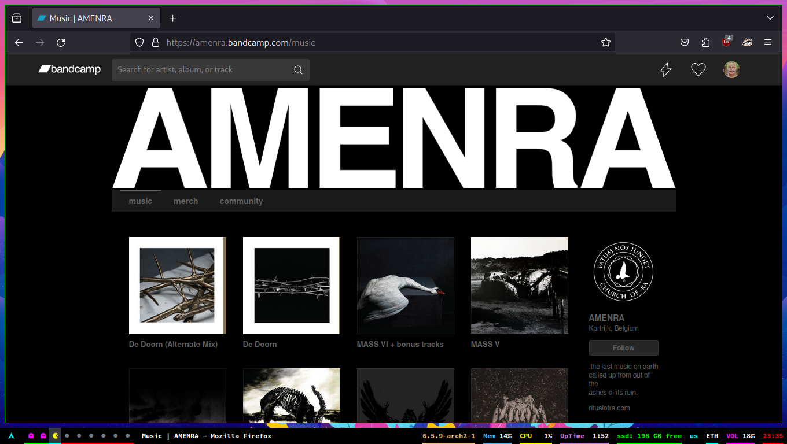

# dotfiles
Customization Files for Linux or Other Unix-Based System. This Repository Contains My Personal Dotfiles.

## Screenshot

<b>Extra Screenshots</b>

||||
|:-:|:-:|:-:|
||||

## Info

* **Distro** - **[Artix Linux](https://artixlinux.org/)**.
* **System Init** - [runit](http://smarden.org/runit/).
* **WM** - [BSPWM](https://github.com/baskerville/bspwm).
* **Bar** - [Polybar](https://github.com/polybar/polybar).
* **Menu** - [Rofi](https://github.com/davatorium/rofi).
* **Compositor** - [Picom](https://github.com/yshui/picom).
* **Terminal** - [Kitty](https://sw.kovidgoyal.net/kitty/).
* **Editor** - [Vim](https://www.vim.org/).
* **Browser** - [FireFox](https://www.mozilla.org/en-US/firefox/new/).
* **Desktop Root Menu** - [jgmenu](https://jgmenu.github.io/).
* **System Monitor** - [Conky](https://github.com/brndnmtthws/conky).
* **Shell** - [Bash](https://www.gnu.org/software/bash/).

## Requirements

  
