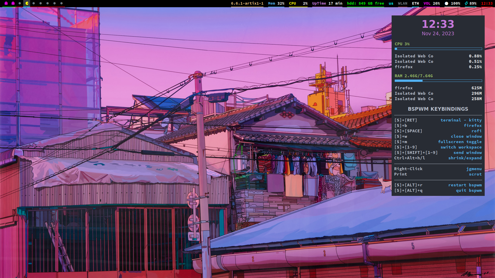

# dotfiles
Customization Files for Linux or Other Unix-Based System. This Repository Contains My Personal Dotfiles.


⚠️ **NOTE!!!!!** This configuration was made for my Laptop, so some things might not work on your PC or Laptop as this was never intended to be a usable full fledged system, in that case, please try if you can fix that up as much as possible, or you can open an issue for help :) - This was made for a **1920x1080** screen and on a **Laptop** with **96** dpi.

## Screenshot

## Info


```mint
⠀⠀   🌸 Setup / Hyprland 🌸
 -----------------------------------

 ╭─ Distro  -> Archcraft x86_64
 ├─ Editor  -> VSCode / NeoVim
 ├─ Browser -> Firefox
 ├─ Shell   -> ZSH
 ╰─ Resource Monitor -> Btop

 ╭─ Model -> ASUS TUF Gaming A15
 ├─ CPU   -> Ryzen 7 4800H @ 4.3GHz
 ├─ GPU   -> NVIDIA GeForce RTX 3050
 ╰─ Resolution -> 1920x1080

 ╭─ WM       -> Hyprland
 ├─ Terminal -> Kitty
 ├─ Theme    -> Tokyonight-Dark-BL-LB
 ├─ Icons    -> Tokyonight-Moon
 ├─ Font     -> CaskaydiaCove Nerd Font
 ╰─ Hotel    -> Trivago

                        
```

## Requirements
```sh
git clone https://github.com/soelz4/dotfiles.git
```
```sh
cd dotfiles
```
```sh
chmod +x pkgs.sh
```
```sh
./pkgs.sh
```

<br></br>
