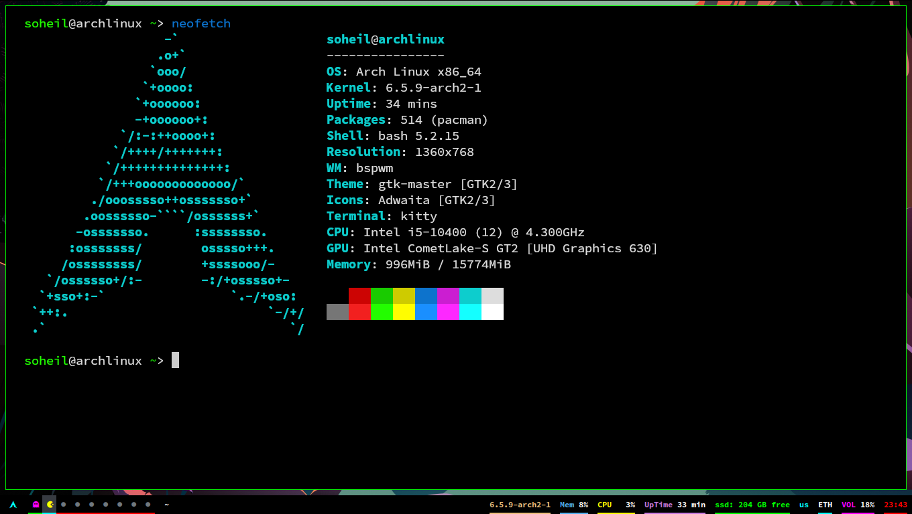
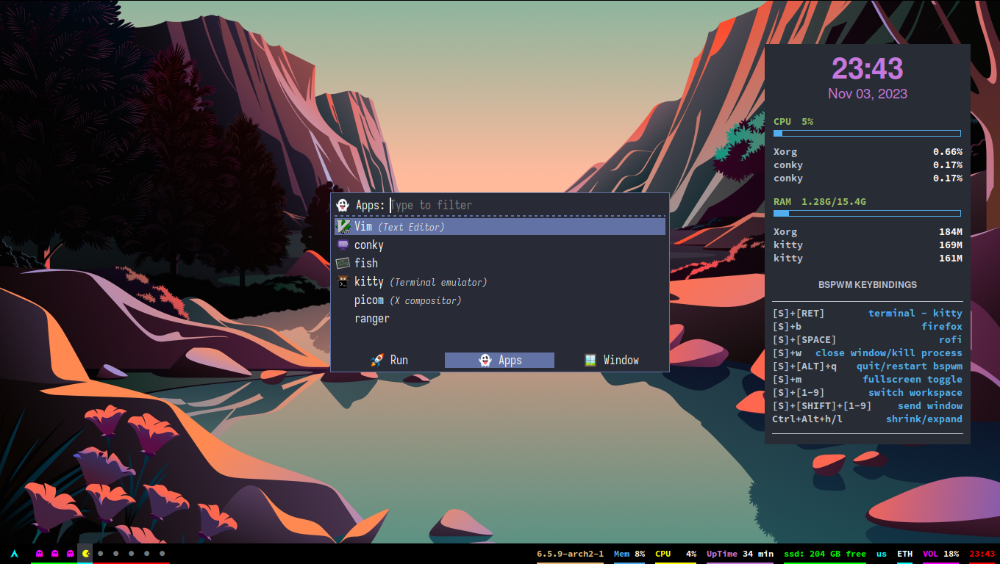
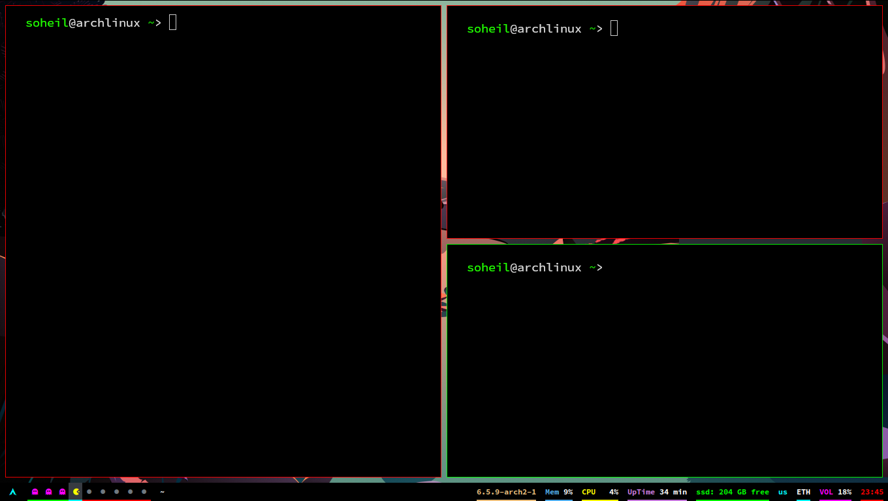
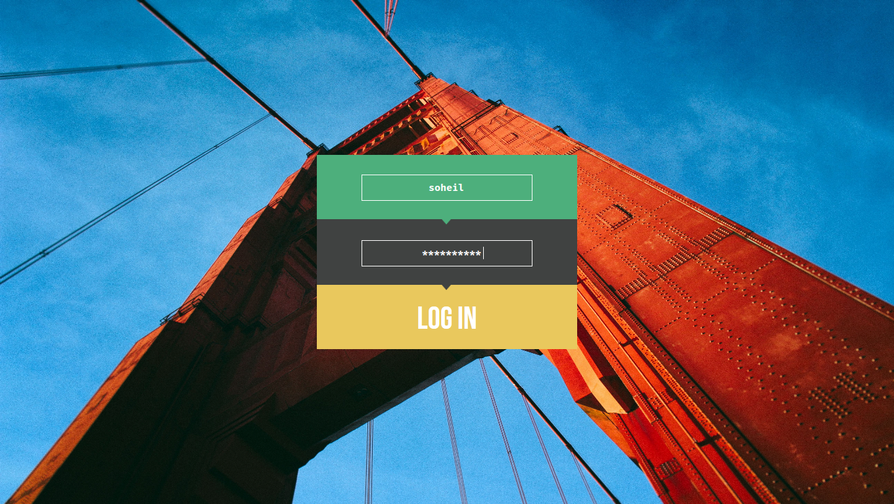
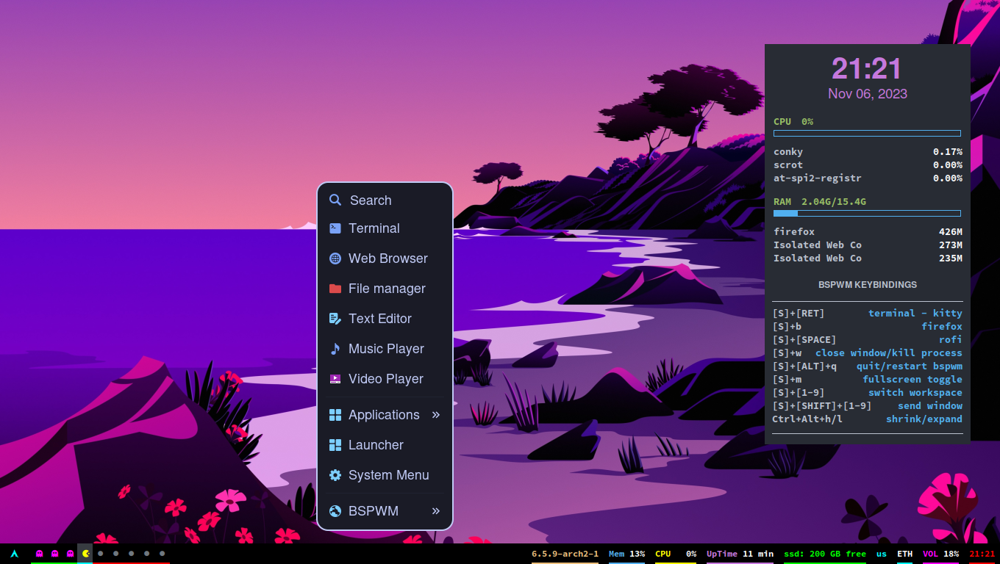
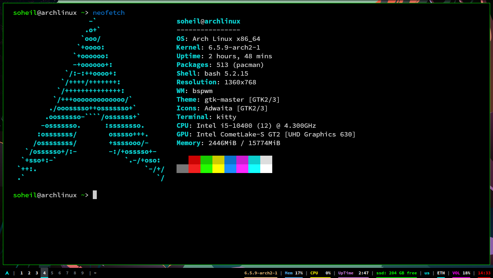

# dotfiles
Customization Files for Linux or Other Unix-Based System. This Repository Contains My Personal Dotfiles.

## Screenshot

<b>Extra Screenshots</b>

||||
|:-:|:-:|:-:|
||||

## Info
|Distro|[Arch](https://archlinux.org/)|
|:---:|:---:|
|WM|[BSPWM](https://github.com/baskerville/bspwm)|
|Bar|[Polybar](https://github.com/polybar/polybar)|
|Menu|[Rofi](https://github.com/davatorium/rofi)|
|Compositor|[Picom](https://github.com/yshui/picom)|
|Terminal|[Kitty](https://sw.kovidgoyal.net/kitty/)|
|Editor|[Vim](https://www.vim.org/)|
|Browser|[FireFox](https://www.mozilla.org/en-US/firefox/new/)|
|File Manager|[Ranger](https://ranger.github.io/)|
|Display Manager|[Slim](https://slim-fork.sourceforge.io/)|
|Desktop Root Menu|[jgmenu](https://jgmenu.github.io/)|
|System Monitor|[Conky](https://github.com/brndnmtthws/conky)|
|Shell|[Bash](https://www.gnu.org/software/bash/)|
|Aur Helper|[Yay](https://github.com/Jguer/yay)|
